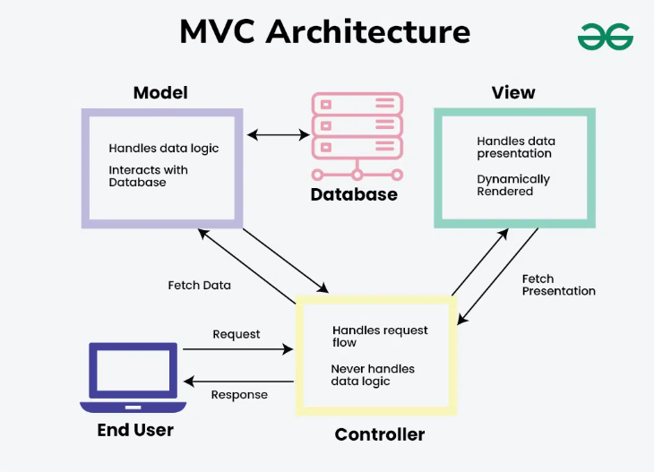
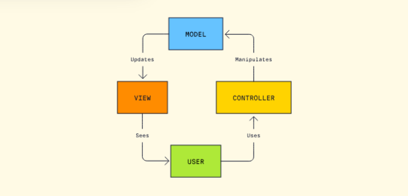
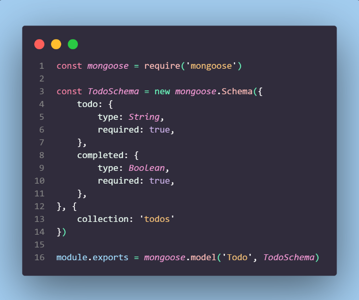
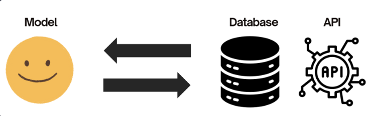
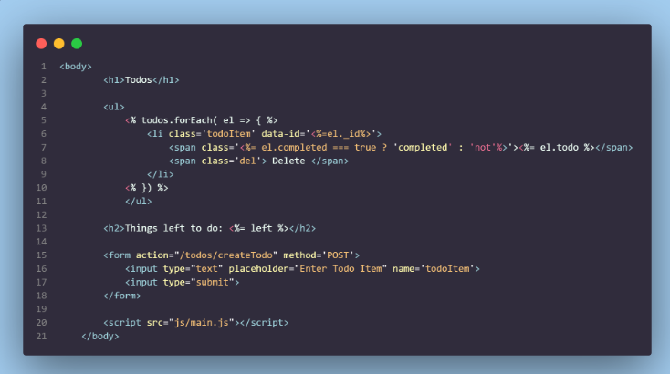
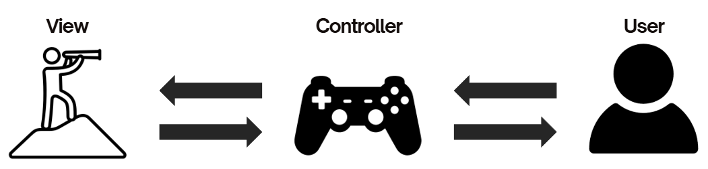
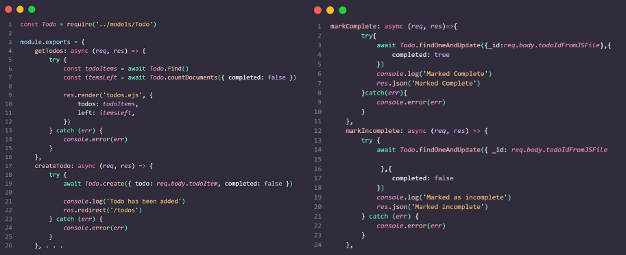
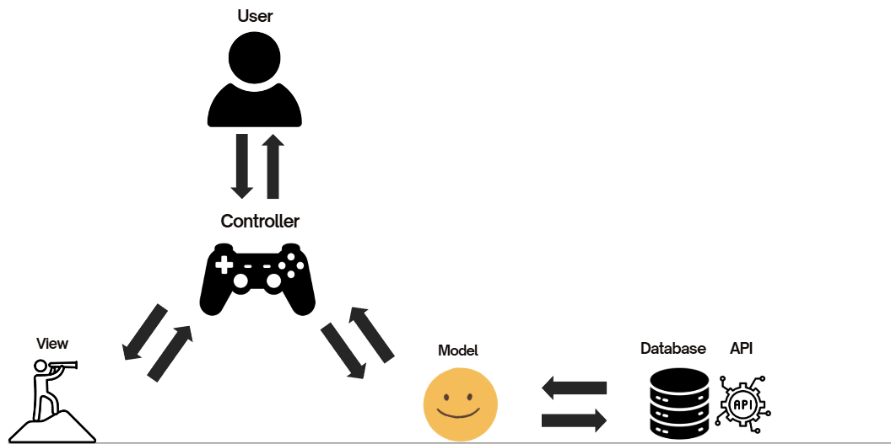

# MODELS, VIEWS, CONTROLLERS (MVC)

If you want to see this in presentation form with images, click [here](https://drive.google.com/file/d/1x1OQlmxUYDJ8X7k_y7STIBZyoVMk9iMF/view?usp=sharing)

## What is MVC?

### An Architectural Paradigm

MVC is a design pattern. It’s a certain way software developers organise code to reduce complexity, reduce large amounts of code in one file, separates concerns, makes working together on a project easier, makes it easier to manage, scale, and maintain projects, and much more!

### Why MVC?

- Widely adopted
- Scores high for reusability and scalability
- Can test for each individual component

## Quick Description

### Model

This is the only thing interacting with the database. The Model is responsible for fetching, storing, and updating data, usually found in the database.

### View

The only job of the view is to hold what the user is viewing! Views handle the layout, design, and visual representation of data.

### Controller

The job of the controller is to process user input, interact with the Model to retrieve or update data, and determine the appropriate View to display the response. Basically, this is the middleman for essentially everyone!

## Model

### Manages Data

- The Model is responsible for fetching, storing, and updating data.
- It can retrieve data from databases, APIs, or other services.

### Business Logic

- The Model enforces rules, calculations, or constraints on the data.
- For example, it might validate that a user's password is strong before saving it.

### Independent of Views

The Model doesn’t concern itself with how the data is displayed, its sole purpose is to process and provide data.

## Views

### Presentation-Focused

- Views handle the layout, design, and visual representation of data.
- They use technologies like HTML or templating engines.

### Dynamic Content

Views can dynamically display data based on user input or backend responses.

### User Interaction

In some cases, Views also handle user interactions like clicking buttons or submitting forms, but they typically pass these inputs to the Controller for processing.

## Controllers

### Handles Requests

- Receives user inputs (e.g., form submissions, button clicks, API calls).
- Determines what action to take based on the request.

### Interacts with the Model

- Fetches data from the Model or instructs the Model to modify data.
- Applies any necessary business logic.

### Updates the View

Passes data retrieved from the Model to the View for presentation.

## More Resources

https://www.codecademy.com/article/mvc

https://developer.mozilla.org/en-US/docs/Glossary/MVC

https://www.tutorialspoint.com/mvc_framework/mvc_framework_introduction.htm

https://www.techtarget.com/whatis/definition/model-view-controller-MVC

https://www.youtube.com/watch?v=DUg2SWWK18I
